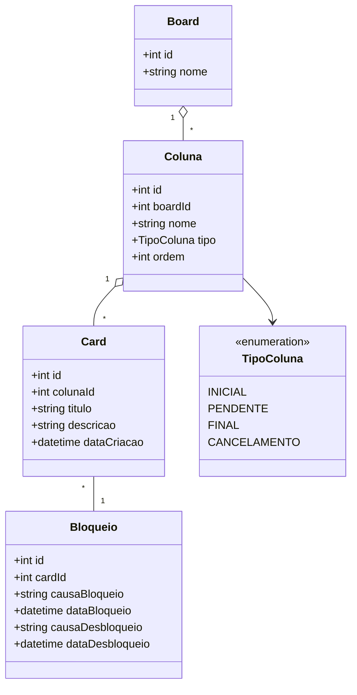

# desafio-dio-board-tarefas
Desafio Java para criar um board customizável.

## Diagrama de Classes

```mermaid
classDiagram

class Board {
  +int id
  +string nome
}

class Coluna {
  +int id
  +int boardId
  +string nome
  +TipoColuna tipo
  +int ordem
}

class Card {
  +int id
  +int colunaId
  +string titulo
  +string descricao
  +datetime dataCriacao
}

class Bloqueio {
  +int id
  +int cardId
  +string causaBloqueio
  +datetime dataBloqueio
  +string causaDesbloqueio
  +datetime dataDesbloqueio
}

class TipoColuna {
  <<enumeration>>
  INICIAL
  PENDENTE
  FINAL
  CANCELAMENTO
}

Board "1" o-- "*" Coluna
Coluna "1" o-- "*" Card
Card "*" -- "1" Bloqueio
Coluna --> TipoColuna
```
